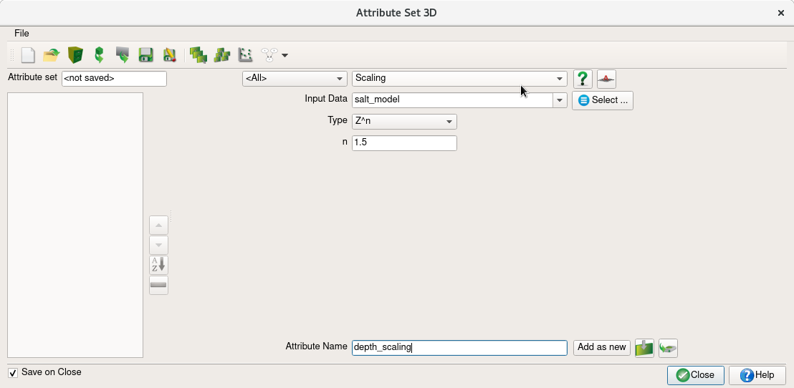
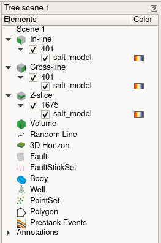

# Opendtect tutorial

## Installation

Download the package from: https://www.dgbes.com/index.php/download

Go to the download directory and execute the installation shell script:

```
mv ~/Downloads
chmod +x OpendTect_Installer_lux64.sh
./OpendTect_Installer_lux64.sh
```

Follow the instructions and install just the basic version of OpendTect:


## Start OpendTect

If you followed the default installation setting, OpendTect will be installed in your home directory at `~/OpendTect`. Start the program as follows (set `6.4.0` to whichever version you installed):

```
cd ~/OpendTect/6.4.0
chmod +x start_dtect
./start_dtect
```

The first time, you will be asked to set a default directory for your data. Create and choose a directory on you computer that has suffient space, e.g. on your scratch/data disk: `/data/username/opendtect`.


## Create a SEG-Y data cube

If your 2D/3D RTM image is not in SEG-Y format already, create a SEG-Y file with the correct headers using the accompanying Julia script `create_segy_data.jl`. For the headers, we will simply populate the entries `cdpx` and `cdpy` with the trace number in the X and Y direction. Save your data cube as a SEG-Y file and keep track of the file location for the subsequent steps.


## Set up a new survey

Set up a new survey by clicking on Survey (top left corner) and then choose `Select/Setup` -> `Create new survey`. Choose a survey name, select the dimensions of the data cube (i.e. 3D) and set the Z domain to depth (for RTM images):


Next, you will be asked to choose an input file. Select the SEG-Y file of your RTM image and set the `Data type` to `3D Seismic Data` (for stacked/migrated data):


: Ensure that the In-line and Cross-line ranges, as well as the X-coordinate and Y-coordinate ranges show the correct number of traces of your 3D data cube.

Selecting your SEG-Y file will perform a scan of the 1000 traces of the data cube. If the headers are set up correctly, you should see the correct trace range under `In-line range` and `Cross-line range`. E.g. in this example, there are 801 traces in both X and Y direction. Note that the in-line header (Xcdp) is stored at byte 181 and the cross-line header is stored at byte 185.


If the quick scan results shows the correct headers as shown above, choose `Ok` to proceed. If asked if you want to proceed without scanning the full file, confirm. In the next window (Figure #f4), confirm once more that the survey ranges and coordinates show the correct ranges of traces. Then select `Ok` and select the newly created survey -> `Select`. Select `no` if asked whether you want to import the SEG-Y data for this survey.

Next, OpendTect will ask you to adjust the z-axis of your data cube. Choose a scaling value, such that your empty data cube looks like the cube in the following figure:


## Import SEG-Y data

So far, you have only set the survey area for your RTM image. Next, we will upload the actual SEG-Y file into OpendTect, so that we can plot slices from the data cube. To import the data, go to `Survey` (top left corner)-> `Import` -> `Seismic` -> `SEG-Y` -> `Volume` and select your SEG-Y file:


As before, ensure that the correct trace ranges are shown as in Figure #f6. Then, click on `Next` and you will see the screen in Figure f7a. Click on the lower `select` box, next to Output Cube. This will bring you to the the following screen:


Enter a name, under which your data will be stored, e.g. `salt_model`. Select `Ok` and then `Import`. If the data has been imported successfully, you should see the following output:

#### Figure: {#f8}
{width=30%}
: If the data was imported successfully, you should see this info box.


## Plot SEG-Y data

Create a vertical slice through your data cube, by right-clicking on `In-line` within the `Elements` window of your screen:

#### Figure: {#f9}
{width=40%}

Click on `Add and select data` and select the data set that you created in the previous step. This will create a 2D in-line slice. If you then click on the hand symbol on the left-hand side, you can move the survey box such that you see your slice:

#### Figure: {#f10}
{width=100%}

Repeat this step for the Cross-line and Z-slice elements to get a 3D cross section like this:

#### Figure: {#f11}
{width=100%}


## Apply amplitude gains

To apply an automatic gain control, or a depth scaling to your image, select `Analysis` (top left) and `Attribute`. Make sure the left hand box is set to `<All>` and then select `Scaling` in the box next to it:


#### Figure: {#f12}
{width=90%}

Select the data set we created earlier under `Input Data` and choose a new name under which to save the attribute (e.g. `depth_scaling`). Available scalings under `Type` include `AGC` and `Z^n`. Here, we use a power scaling, that scales the samples by an exponant of 1.5. After you created a new attribute name, click on `Add as new` and then `Close`.


To apply the depth scaling to one of the data slices, right-click on one of you slices that are listed in the `Elements` window (e.g. `401` in Figure 13a). Select `Add` -> `Attribute`. Select the depth scaling attribute from the last step (Figure 13b). To apply the depth scaling to all slices, repeat this step for the cross line and depth slice as well.


#### Figure: {#f13}
{width=41%}
{width=61%}


## Exporting figures

To export figures of your current screen, click on the camera symbol on the left-hand side. Select `Scene` to capture only the image without the editor. Next, set the correct resolution (dpi) and choose a filename to export the figure to:

#### Figure: {#f14}
{width=60%}
